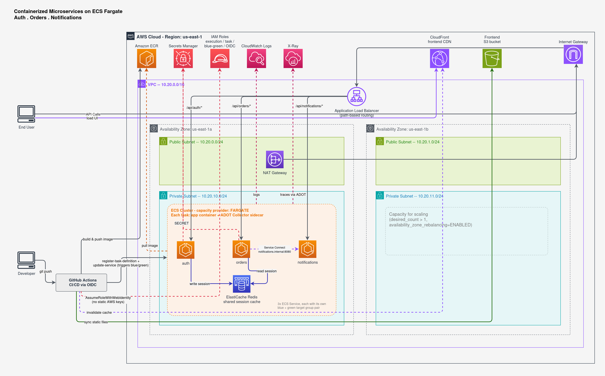

# Containerized Microservices on Amazon ECS Fargate

A monolith-to-microservices migration pattern built as a hands-on study project: three Go services (**Auth**, **Orders**, **Notifications**) running on **ECS Fargate**, fronted by an **Application Load Balancer**, discovering each other over **ECS Service Connect**, sharing session state in **ElastiCache Redis**, pulling secrets from **Secrets Manager**, deployed **blue/green** with zero downtime, and traced end-to-end with **X-Ray**. All infrastructure is Terraform; all deployments are GitHub Actions.

This README is written AWS-first on purpose: the goal of the project is demonstrating SAA-relevant architecture decisions (networking, compute, security, resilience, cost), not the application code, which is deliberately minimal.




---

## Table of Contents

- [Customer Scenario](#customer-scenario)
- [Architecture Overview](#architecture-overview)
- [Why This Architecture: AWS Design Decisions](#why-this-architecture-aws-design-decisions)
- [AWS Services Used](#aws-services-used)
- [Running Locally](#running-locally)
- [Deploying to AWS](#deploying-to-aws)
- [Testing the Live Deployment on AWS](#testing-the-live-deployment-on-aws)
- [Known Limitations](#known-limitations)

A browser-based console (`frontend/`) is also included for testing and
visualizing the running system
[**Live link**](https://d3faa1nffwbywe.cloudfront.net/).

---

## Customer Scenario

**ShopWave** is a fictional online retailer whose checkout flow is a single Node.js monolith. Three problems keep coming up as the business grows:

- A bug in the notification code once took the whole checkout process down with it, because everything ships and deploys together.
- During flash sales, Orders needs far more capacity than Auth or Notifications do - but scaling the monolith means scaling all of it.
- Every deployment is all-or-nothing: a bad release means a full rollback, and there's no way to shift traffic gradually or verify a new version before it takes 100% of the load.

**User stories:**

| As a... | I want to... | So that... |
|---|---|---|
| Customer | log in once and stay authenticated across pages | I don't get logged out mid-checkout just because my request landed on a different backend instance |
| Customer | place an order and get confirmation it was received | I trust the platform with my purchase |
| Customer | experience no downtime during ShopWave's frequent deployments | I can shop at any time, including while engineers ship changes |
| Platform engineer | deploy Orders independently of Auth and Notifications | a change to one service can't break or block the others |
| Platform engineer | catch a bad deployment before it reaches all traffic | a broken release doesn't take down the whole platform |
| Platform engineer | see how a request moves across services when something's slow | I can find the actual bottleneck instead of guessing |

Everything in this architecture is a direct answer to one of these: splitting
into three services answers independent deployability; **ElastiCache** answers
the session problem; **blue/green ECS deployments** answer the downtime and
bad-release problems; **X-Ray** answers the visibility problem.

## Architecture Overview

```
End User's browser
   |
   +--(1) load the UI --> CloudFront --> S3 (private, via Origin Access Control)
   |
   +--(2) API calls (CORS) --> Internet Gateway --> Application Load Balancer
                                    (path-based routing: /api/auth/*, /api/orders/*, /api/notifications/*)
                                       |
                                       +-- ECS Fargate Service: auth ----------+
                                       +-- ECS Fargate Service: orders --------+---> ECS Service Connect (internal DNS)
                                       +-- ECS Fargate Service: notifications -+
                                       |
                                       +--> ElastiCache Redis (shared session cache, read by auth + orders)
                                       +--> Secrets Manager (API_KEY injected into auth + orders at launch)
                                       +--> ECR (3 private repos, one per service, scan-on-push)
                                       +--> CloudWatch Logs (container + ADOT Collector sidecar logs)
                                       +--> X-Ray (traces exported by an ADOT Collector sidecar in every task)

GitHub Actions --[OIDC, no static AWS keys]--> IAM Role --> ECR push + ECS deploy + S3 sync + CloudFront invalidation
```

The frontend is a plain HTML/JS single page — no framework, no build step —
that calls the ALB directly from the browser. It never sits between the user
and the API; it's just the UI for exercising the three services and watching
them run.

See the full diagram at the top of this document for the VPC/subnet/AZ layout.

## Why This Architecture: AWS Design Decisions

This section maps each decision back to the AWS Well-Architected Framework
pillars.

### Reliability

- The VPC spans **two Availability Zones**, each with a public and a private subnet, so the design tolerates the loss of a single AZ.
- The ALB is a **Layer 7, multi-AZ** load balancer - it doesn't live in one subnet, it has an elastic network interface in each AZ's public subnet.
- Each ECS service uses **native ECS blue/green deployment** (not a rolling deployment): a full second set of tasks ("green") is launched and health-checked *before* any production traffic shifts to it, with a bake-time window and automatic rollback if the new version fails its target group health check. This directly answers the "no downtime during deployments" user story.
- `availability_zone_rebalancing = "ENABLED"` on every service means the design already supports running `desired_count > 1` and having ECS spread tasks across both AZs - the demo runs one task per service to stay cheap, but the architecture doesn't have to change to scale that.

### Security

- **Defense in depth via subnets**: ECS tasks and ElastiCache sit in **private subnets** with no public IP. Only the ALB is internet-facing.
- **Security groups scoped tightly**: the ALB's security group is the only one allowed to reach the ECS tasks' security group; only the ECS tasks' security group can reach ElastiCache's port. Nothing is open to `0.0.0.0/0` except the ALB's listener port.
- **Two different IAM roles per task**: the **execution role** is what *ECS itself* uses to pull the container image, write logs, and fetch secrets; the **task role** is what *the application code* is allowed to do via the AWS SDK once it's running.
- **No hardcoded credentials anywhere.** The one credential this project uses (a placeholder API key) lives in **Secrets Manager** and is injected as a plain environment variable by ECS at container launch - the application code never touches the Secrets Manager API directly.
- **No long-lived AWS keys in CI.** GitHub Actions assumes an IAM role via **OIDC federation**, using a short-lived, per-run token instead of a stored access key pair.

### Performance Efficiency

- **Fargate** removes server management entirely - no EC2 instances to patch or right-size for the container host itself.
- **ElastiCache Redis** gives all stateless containers a shared, low-latency session store, so a request can land on *any* task of *any* service without needing sticky sessions or re-authentication.
- **ECS Service Connect** lets Orders call Notifications over a private, low-latency path inside the VPC, without a round trip out through the public ALB and back in.

### Cost Optimization

- A **single NAT Gateway** for the whole VPC instead of one per AZ (this is a real trade-off against the "Reliability" pillar above - because for a learning project the savings outweighs the AZ-level redundancy it gives up).
- The smallest practical **Fargate task size** (0.25 vCPU / 1 GB) and the smallest **ElastiCache node type** (`cache.t4g.micro`).
- An **ECR lifecycle policy** automatically expires untagged image layers so the registry doesn't grow unbounded.

### Operational Excellence

- **100% Infrastructure as Code** (Terraform) every resource in this README was created by `terraform apply`, not the console, and the same code can reproduce the environment from scratch.
- **One reusable Terraform module** (`infra/modules/microservice`) is instantiated three times (once per service) instead of copy-pasting the same ECS service/target group/listener rule block three times, a single source of truth for how "a service" is defined in this system.
- **CI/CD via GitHub Actions**, not manual deploys: pushing to `main` builds, pushes to ECR, and triggers each service's blue/green deployment automatically.
- **Centralized logs** (CloudWatch) and **distributed tracing** (X-Ray) mean a problem can be diagnosed from telemetry instead of SSH-ing into a container that no longer exists five minutes later.

### Why S3 + CloudFront instead of ECS for the frontend

The frontend is a static single page with no server-side logic, it doesn't need a running process, so putting it on Fargate would mean paying for and managing compute (plus a task definition, blue/green target groups, and a listener rule) 24/7 just to serve files that never change at request time. **S3 + CloudFront** is effectively free at this scale, there's no compute to patch or scale, and CloudFront's default certificate gives the whole frontend HTTPS for free.

### A design decision that changed mid-project (and why that's worth reading)

The original design used classic Cloud Map DNS-based service discovery (`service_registries` on the ECS service). The first `terraform apply` against it failed with:

```
InvalidParameterException: Service Registries are only supported for ROLLING deployment strategy.
```

Classic Cloud Map integration is **incompatible with native ECS blue/green
deployments** — that's a documented AWS API constraint. The fix was **ECS Service Connect** instead, which AWS built specifically to work alongside blue/green. The application code and every environment variable are unaffected (`orders` still calls `http://notifications.internal:8080` exactly as before), only the underlying discovery mechanism changed.

## AWS Services Used

| Service | Role in this architecture |
|---|---|
| Amazon VPC | Network isolation: 2 AZs, public + private subnets |
| Internet Gateway / NAT Gateway | Controlled ingress/egress for public and private subnets |
| Application Load Balancer | Path-based routing to 3 services; blue/green traffic shifting |
| Amazon ECS on Fargate | Serverless container orchestration; blue/green deployment strategy |
| Amazon ECR | Private container registry with vulnerability scan-on-push |
| ECS Service Connect (Cloud Map) | Internal service-to-service discovery |
| AWS Secrets Manager | Runtime credential injection, no hardcoded secrets |
| Amazon ElastiCache (Redis) | Shared session cache across stateless containers |
| AWS IAM | Execution role / task role / OIDC role separation, least privilege |
| Amazon CloudWatch | Centralized container and sidecar logs |
| AWS X-Ray (via ADOT) | Distributed tracing, service map |
| Amazon S3 | Private static hosting for the frontend, accessed only via CloudFront |
| Amazon CloudFront | CDN + free HTTPS for the frontend; Origin Access Control to keep S3 private |


## Running Locally

```bash
docker compose up --build
```
**Testing the servise**

```bash
TOKEN=$(curl -s -X POST localhost:8081/login -d '{"username":"Ahmed","password":"anything"}' | jq -r .token)
curl -s -X POST localhost:8082/orders -H "Authorization: Bearer $TOKEN" -d '{"item":"keyboard","quantity":1}'
curl -s localhost:8083/notifications
```

## Deploying to AWS

```bash
cd infra
cp terraform.tfvars.example terraform.tfvars   #  set github_repo to "your-username/your-repo"
terraform init
terraform apply
```

Then set these **GitHub repository variables** (Settings → Secrets and variables → Actions → Variables) from the Terraform outputs:

| Variable | Terraform output |
|---|---|
| `ACTIONS_ROLE_ARN` | `github_actions_role_arn` |
| `AWS_REGION` | (whatever you set - default `us-east-1`) |
| `PROJECT_NAME` | (whatever you set - default `microdemo`) |
| `ECS_CLUSTER_NAME` | `ecs_cluster_name` |
| `ALB_DNS_NAME` | `alb_dns_name` |
| `FRONTEND_BUCKET_NAME` | `frontend_bucket_name` |
| `CLOUDFRONT_DISTRIBUTION_ID` | `cloudfront_distribution_id` |

Push to `main` and GitHub Actions builds and deploys all three services plus the frontend.

## Testing the Live Deployment on AWS

### Option A: the UI console (easiest)

```bash
terraform -chdir=infra output frontend_url
```

Open that URL. It's a small browser console (login, place an order, watch notifications and service health) that exercises the same three services the curl commands below hit - useful for actually *seeing* the system run rather than reading JSON in a terminal. It talks to the ALB directly from your browser, so if it can't reach a service, your browser's network tab will show exactly which call failed and why - often more useful for debugging than curl's plain "connection refused."

### Option B: curl, for scripting or when you want to see raw responses

Get the load balancer's public address:

```bash
ALB=$(terraform -chdir=infra output -raw alb_dns_name)
```

**1. Health checks** (confirms the ALB, target groups, and each service are
all wired correctly):

```bash
curl -i http://$ALB/api/auth/health
curl -i http://$ALB/api/orders/health
curl -i http://$ALB/api/notifications/health
```

Each should return `200 ok`. A `404` here almost always means a listener rule / path mismatch; a `503` means the target group has no healthy targets yet - check the ECS service's events tab in the console.

**2. Full request flow** (exercises the shared session cache and Service Connect in one pass):

```bash
TOKEN=$(curl -s -X POST http://$ALB/api/auth/login \
  -d '{"username":"Ahmed","password":"anything"}' | jq -r .token)

curl -s -X POST http://$ALB/api/orders/orders \
  -H "Authorization: Bearer $TOKEN" -d '{"item":"keyboard","quantity":1}'

curl -s http://$ALB/api/orders/orders -H "Authorization: Bearer $TOKEN"

curl -s http://$ALB/api/notifications/notifications
```

If the order call succeeds but no notification shows up, that's a Service Connect problem, not an ALB problem - check the `orders` task's logs in CloudWatch for the outbound call to `notifications.internal:8080`.

**3. Verify a blue/green deployment in the AWS Console:**

- ECS console → cluster → service → **Deployments** tab: push any commit to `main` and watch a second, "green" deployment appear, pass its health checks, and take over traffic - the "blue" deployment then scales to zero after the bake time instead of being killed immediately.
- EC2 console → Load Balancing → Target Groups: each service has a `-blue` and a `-green` target group; watch registered targets move between them during a deployment.

**4. Verify distributed tracing:**

- X-Ray console → **Service map**: after generating some traffic with the commands above, you should see `auth`, `orders`, and `notifications` as nodes, with a traced edge from `orders` to `notifications` - that edge is the Service Connect call.

**5. Confirm the secret was actually injected (without ever printing it):**

```bash
aws logs tail /ecs/$(terraform -chdir=infra output -raw ecs_cluster_name | sed 's/-cluster//')/auth --since 1h | grep "loaded API_KEY"
```

## Known Limitations

- **No HTTPS** — the ALB listens on plain HTTP. A real deployment needs an ACM certificate and an HTTPS listener.
- **`desired_count = 1` per service** - the design supports multi-AZ scaling (see Reliability above) but isn't currently exercising it, to keep the demo's AWS cost low.
- **In-memory data only** there's no RDS/DynamoDB. The point of this project is the surrounding infrastructure, not a persistence layer.
- **Fake authentication** Auth accepts any non-empty username/password.
